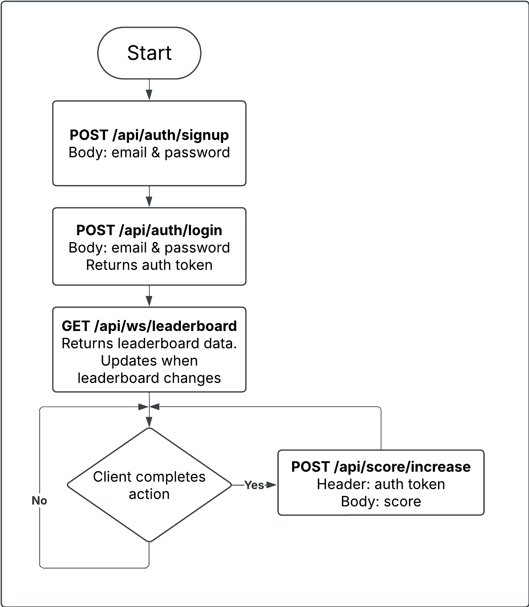

# Problem 6: Architecture

## Endpoints ##
The endpoints were chosen to solely meet the requirements of the task, and not anything more. A more fleshed-out system wpuld have more endpoints.

### Sign Up

**POST** `/api/auth/signup`

Create a new user account. The user's score is initialised to 0.

#### Request Body

```json
{
  "email": "user@example.com",
  "password": "StrongPassword123"
}
```

#### Validation Rules

* Email must be valid format
* Email must be unique

#### Success Response — `201 Created`

```json
{
  "message": "User created successfully"
}
```

#### Error Responses

* `400 Bad Request` – invalid email or password
* `409 Conflict` – email already exists

---

### Login

**POST** `/api/auth/login`

Authenticate a user and return an authentication token.

#### Request Body

```json
{
  "email": "user@example.com",
  "password": "StrongPassword123"
}
```

#### Success Response — `200 OK`

```json
{
  "access_token": "<jwt-token>",
  "token_type": "Bearer",
  "expires_in": 3600
}
```

#### Error Responses

* `401 Unauthorized` – invalid credentials

---

### Increase User Score

**POST** `/api/score/increase`

Increase the authenticated user’s score by the amount in the request body. This endpoint is called when the "action" is completed.

#### Headers

```
Authorization: Bearer <jwt-token>
```
* Token must be valid and unexpired

#### Request Body

```json
{
  "score": 10,
}
```

#### Success Response — `200 OK`

```json
{
  "new_score": 42
}
```

#### Error Responses

* `401 Unauthorized` – missing or invalid token

---

### Get Top 10 Leaderboard (Websocket)

**GET** `/api/ws/leaderboard`

Retrieve the top 10 users ordered by score (descending). 

This is a websocket to allow for live updates of the leaderboard. When the top 10 leaderboard changes, an update is sent to all connections.


#### Leaderboard Update Event

```json
{
    "event": "leaderboard:update",
    "data": {
        "leaderboard": [
            {
                "rank": 1,
                "user_id": "uuid",
                "display_name": "user1",
                "score": 120
            },
            {
                "rank": 2,
                "user_id": "uuid",
                "display_name": "user2",
                "score": 110
            }
        ],
        "updated_at": "2026-01-08T12:00:00Z"
    }
}
```

## Diagram ##
The diagram shows the simple flow of how the endpoints are used. 
